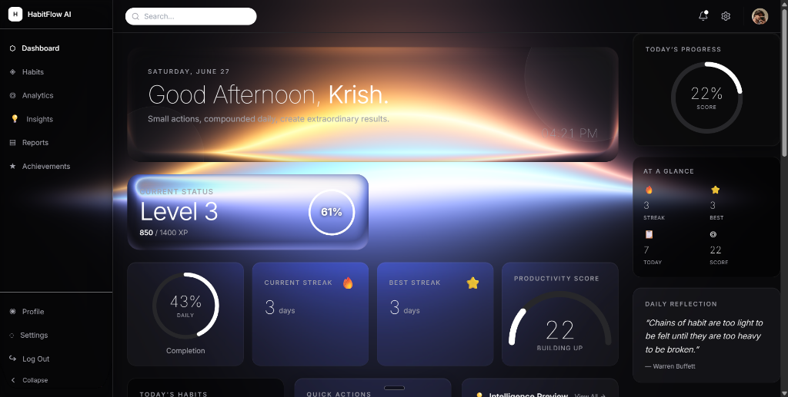
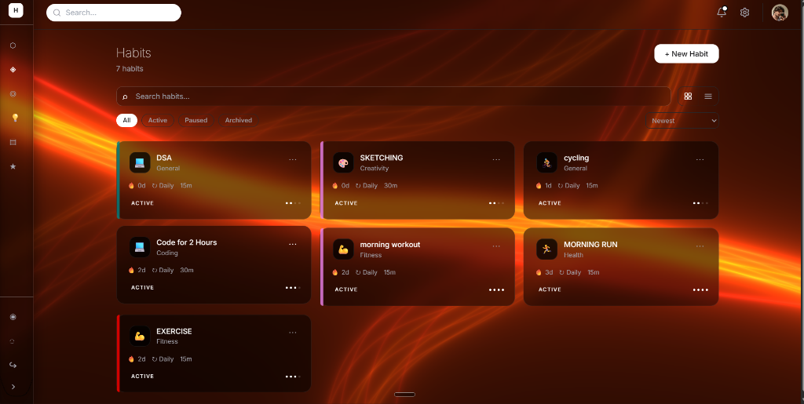
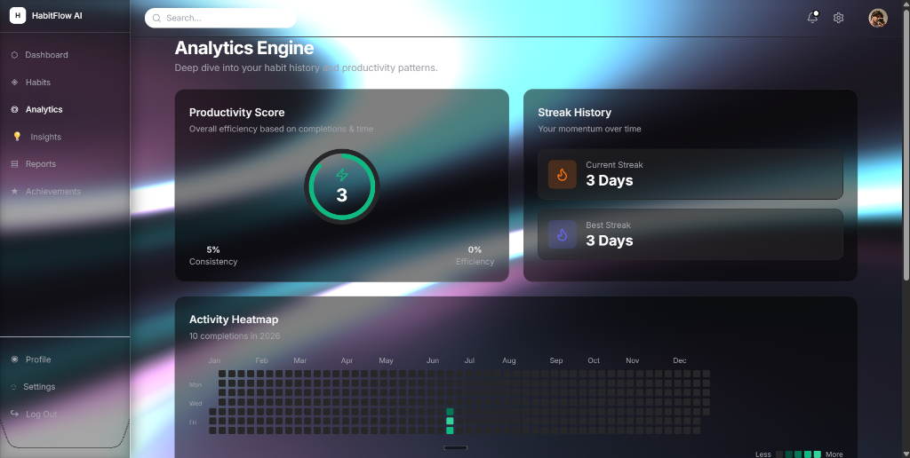
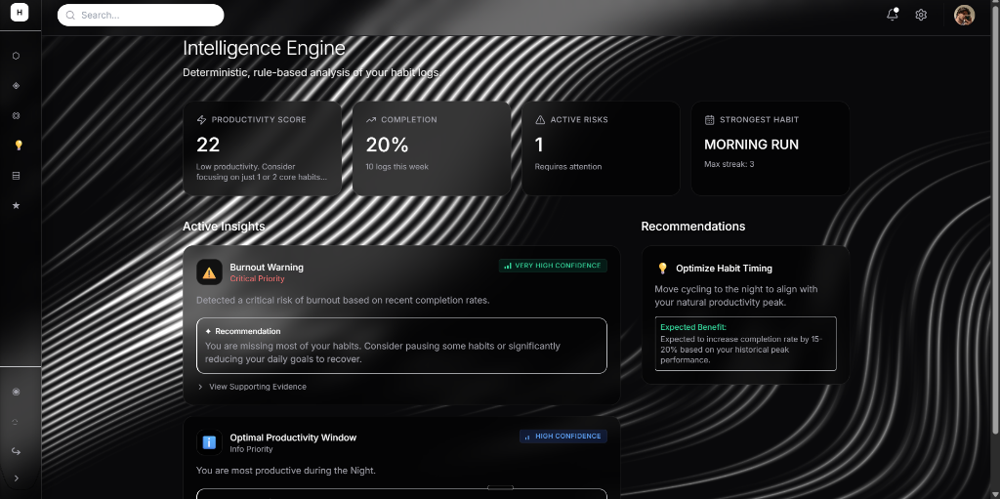
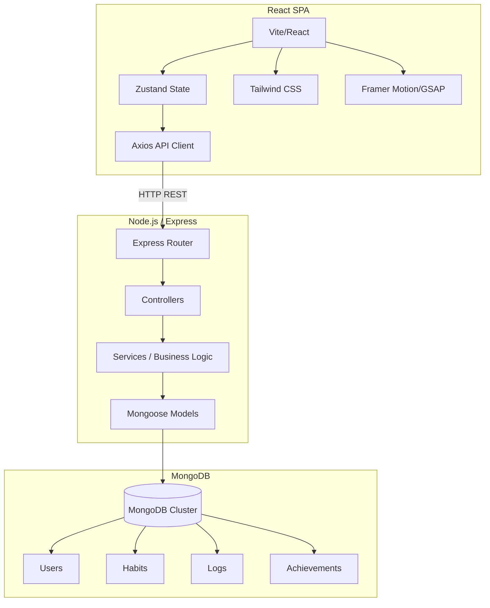
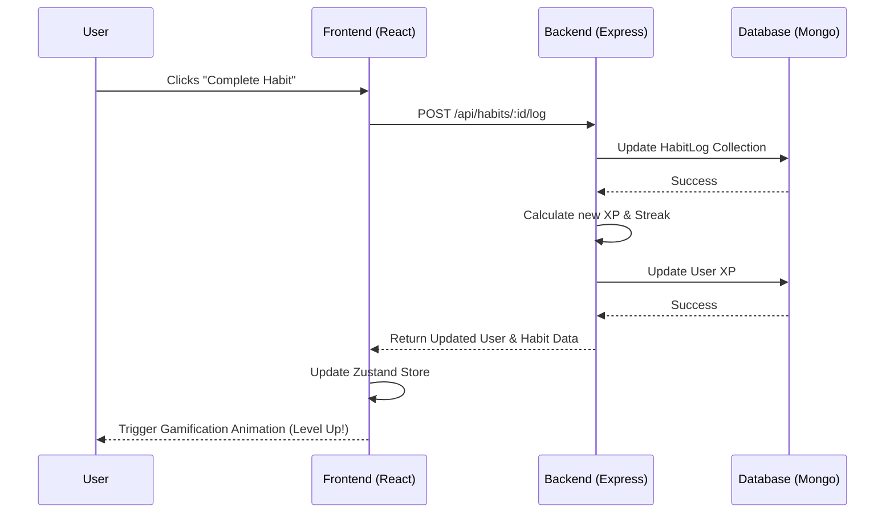
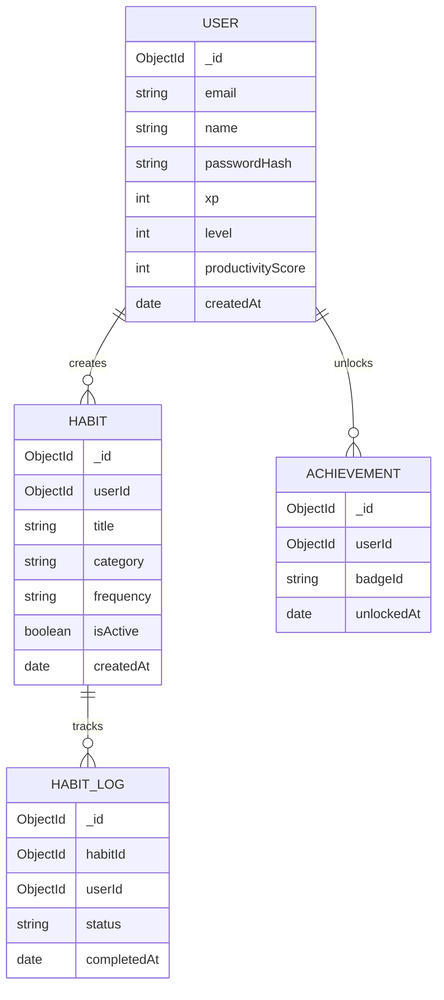

<div align="center">
  
</div>

<h1 align="center">HabitFlow AI</h1>

<div align="center">
  <strong>Build Better Habits. Every Single Day.</strong>
</div>

<br />

<div align="center">
  <a href="#about">About</a> •
  <a href="#screenshots">Screenshots</a> •
  <a href="#features">Features</a> •
  <a href="#architecture">Architecture</a> •
  <a href="#implementation-process">Implementation Process</a> •
  <a href="#api-documentation">API Documentation</a> •
  <a href="#installation">Installation</a>
</div>

<br />

---

## 📖 About The Project

HabitFlow AI is not just another habit tracker. It is a comprehensive, gamified, and AI-driven personal development ecosystem. Built to combat the "Day 1 Restart Syndrome," HabitFlow uniquely combines behavioral psychology with deterministic analytics to offer a raw, unfiltered look at your progress. 

The application is split into two massive core layers:
1. **The Kinetic Landing Experience**: A 6-Act cinematic journey that challenges the user's perception of productivity and introduces them to the HabitFlow philosophy using complex GSAP scroll animations, video loops, and dynamic typography.
2. **The Intelligence Dashboard**: A glassmorphic, highly interactive single-page application (SPA) where users manage habits, review AI-generated insights, track their gamification progress, and view deeply detailed heatmaps.

---

## 📸 Screenshots

Below is a visual tour of the HabitFlow AI platform, showcasing our premium UI/UX design, dark glassmorphism themes, and detailed analytical components.

### Act I - The Problem (Cinematic Hero)
> *Your Potential Is Rotting. Not because of your ambition — that's still intact. It's rotting because you keep starting over. Day 1, again and again.*

*(A full-viewport cinematic hero with looping video background, marquee banners, and deep green aesthetics.)*

### The Dashboard
> *Your daily command center for productivity.*

*(Features a customized greeting, live productivity scores, daily reflection quotes, progress rings, and a sleek quick-action grid.)*

### Habit Management
> *Manage, track, and conquer your active habits.*

*(A dynamic grid displaying all active habits, colored tags, daily requirements, and quick-log buttons layered over dynamic animated Strands backgrounds.)*

### Analytics Engine
> *Deep dive into your habit history and productivity patterns.*

*(Showcasing the 365-day github-style activity heatmap, streak history, and overall productivity gauges.)*

### Intelligence Engine
> *Deterministic, rule-based analysis of your habit logs.*

*(Burnout warnings, optimal productivity windows, and actionable recommendations generated from user behavioral data.)*

### Gamification & Achievements
> *Your progression, achievements, and milestones.*

*(Level progression, XP bars, and an array of unlockable badges like 'The Journey Begins', 'Momentum', and 'Unstoppable'.)*

---

## ✨ Features

### 1. Intelligent Habit Tracking
- **Smart Logging:** One-click logging from the dashboard.
- **Streak Guard:** Advanced streak calculation that forgives predefined skip days without breaking momentum.
- **Flexible Scheduling:** Daily, weekly, or specific days of the week.
- **Categorization:** Tag habits by Health, Fitness, Coding, Reading, and custom domains.

### 2. Gamification Engine
- **XP System:** Gain XP for every habit logged. Earn bonus XP for streaks and perfect weeks.
- **Dynamic Leveling:** Level up based on accumulated XP.
- **Badges & Achievements:** Unlock over 15 dynamic achievements (e.g., *Early Riser*, *Night Owl*, *Zen Master*).
- **Visual Progression:** Beautiful glassmorphic level cards and progress rings.

### 3. Analytics & Data Visualization
- **Activity Heatmap:** A GitHub-style contribution graph detailing completion frequency over the entire year.
- **Productivity Score:** A calculated metric out of 100 representing overall daily efficiency.
- **Streak History:** Track your current streak, best streak, and historical momentum.

### 4. Intelligence Engine (Insights)
- **Burnout Detection:** Alerts you if you are scheduling too many high-effort habits and failing consistently.
- **Optimal Time Windows:** Analyzes when you most frequently complete habits (Morning, Afternoon, Night) and recommends rescheduling to fit your natural rhythm.
- **Priority Recommendations:** Actionable advice such as "Focus on 1 or 2 core habits" when completion rates drop below 30%.

---

## 🏗️ System Architecture

HabitFlow AI uses a modern, decoupled architecture.

### Tech Stack
- **Frontend:** React 18, Vite, TypeScript, Tailwind CSS, Framer Motion, GSAP, Lucide React, Zustand.
- **Backend:** Node.js, Express, TypeScript, Zod.
- **Database:** MongoDB (via Mongoose).
- **Styling:** CSS variables, Tailwind utility classes, custom `.glass-card` and `.liquid-glass` implementations.

### Architecture Diagram



### Data Flow



---

## 🚀 Detailed Implementation Process

The creation of HabitFlow AI was divided into 7 distinct phases, ensuring a modular, scalable, and beautifully designed application.

### Phase 1: Planning and System Design
Before writing a single line of code, the architecture was mapped out.
1. **Requirements Gathering:** Defined the core user loop—Create Habit ➔ Log Habit ➔ Gain XP ➔ View Insights.
2. **Entity Relationship Mapping:** Designed the MongoDB schema. Users needed to relate to Habits, which in turn related to HabitLogs.
3. **Design Language System:** Established a "Dark Cinematic Glass" theme. Decided on `Inter` for UI components, `Instrument Serif` and `Dirtyline` for cinematic display headings, and `Neue Haas Grotesk` for the landing page.

### Phase 2: Database Schema & Backend Setup
1. **Express Boilerplate:** Initialized a TypeScript Node server with `cors`, `helmet`, and `morgan`.
2. **Mongoose Schemas:**
   - `User`: Stored email, password hash, XP, level, and productivity score.
   - `Habit`: Stored title, description, frequency, category, and user reference.
   - `HabitLog`: Recorded specific completion timestamps and statuses (`completed`, `skipped`, `failed`).
3. **Authentication:** Implemented JWT-based authentication with bcrypt for password hashing. Created middleware to protect API routes.

### Phase 3: Server Business Logic & AI Engines
1. **Streak Calculation Service:** Wrote a highly deterministic algorithm that iterates through `HabitLog` dates to calculate current and best streaks, accounting for timezone differences.
2. **Intelligence Engine:** 
   - Created cron-like services that evaluate user data. 
   - Implemented `detectBurnout()` which flags users failing >60% of habits over 7 days.
   - Implemented `calculateOptimalWindow()` by grouping logs into morning (5-12), afternoon (12-17), and night (17-5) buckets.
3. **Gamification Logic:** Developed the XP formula: `XP = Base (50) * Streak Multiplier`. Built a leveling algorithm where `Level = floor(sqrt(XP / 100))`.

### Phase 4: Frontend Scaffolding & State Management
1. **Vite Initialization:** Scaffolded the React app with `vite` and `swc`.
2. **Tailwind Configuration:** Extended the default Tailwind theme in `tailwind.config.js` to include custom colors (`background`, `foreground`, `primary`, `muted`) and custom glassmorphism utilities (`bg-white/10`, `backdrop-blur-md`).
3. **Zustand Store:** Created a highly performant global state `authStore.ts` to hold the JWT token, user object, and loading states, avoiding React Context re-render hell.
4. **React Router:** Set up protected routes (`/dashboard/*`) and public routes (`/`, `/auth/*`).

### Phase 5: UI/UX Development & GSAP Animations
This was the most time-consuming phase, focusing heavily on aesthetics.
1. **The Kinetic Landing Page:** 
   - Built a custom `BoomerangVideoBg.tsx` component that uses an offscreen HTML5 `<canvas>` to capture video frames and play them forward/backward at 30fps for a seamless loop.
   - Implemented GSAP ScrollTrigger to parallax the video background.
   - Created the 6 Acts of the landing page, utilizing `IntersectionObserver` to trigger fade-ins.
2. **The Dashboard Layout:**
   - Built a responsive `Sidebar.tsx` and `TopNavbar.tsx`.
   - Developed `DashboardLayout.tsx` utilizing a 3-column CSS Grid.
   - Integrated `framer-motion` for page transitions (`AnimatePresence`) and stagger animations for widgets.
3. **Glassmorphic Components:**
   - Created the `.liquid-glass` CSS class featuring XOR masking for ultra-premium translucent borders.

### Phase 6: Gamification Engine Integration
1. **Badges System:** Created a dummy data layer for Achievements (e.g., 'Early Riser', 'Zen Master') to populate the Gamification gallery.
2. **Level Up UI:** Built a custom `LevelCard.tsx` that uses an SVG circle with `stroke-dasharray` to smoothly animate the XP progress ring.
3. **Daily Reflection:** Developed a `QuoteCard.tsx` that intelligently offsets daily quotes so multiple instances on the dashboard do not repeat.

### Phase 7: Deployment & Optimization
1. **Asset Optimization:** Moved heavy videos to an AWS CloudFront CDN to ensure the React bundle remains lightweight.
2. **TypeScript Strictness:** Enforced strict type checking (`noImplicitAny`) across both `client` and `server` to guarantee runtime safety.

---

## 📊 Database ERD



---

## 🗂️ Directory Structure

```text
HABITFLOW AI/
├── client/                     # React Frontend
│   ├── public/                 # Static assets
│   ├── src/
│   │   ├── animations/         # Framer Motion & GSAP configs
│   │   ├── api/                # Axios interceptors & endpoints
│   │   ├── assets/             # Images & SVGs
│   │   ├── components/         # Reusable React components
│   │   │   ├── dashboard/      # Dashboard specific widgets
│   │   │   ├── gamification/   # Badges, Level cards, XP bars
│   │   │   ├── habits/         # Habit creation forms & lists
│   │   │   ├── insights/       # Intelligence engine UI
│   │   │   └── ui/             # Buttons, Inputs, Glass surfaces
│   │   ├── hooks/              # Custom React hooks (e.g., useDashboard)
│   │   ├── pages/              # Route entry points (Home, Dashboard)
│   │   ├── router/             # React Router definitions
│   │   ├── store/              # Zustand global state
│   │   ├── styles/             # Global CSS, Tailwind base
│   │   └── types/              # TypeScript interfaces
│   ├── index.html              # HTML Entry (Fonts & Meta tags)
│   ├── tailwind.config.js      # Theme configuration
│   └── tsconfig.json           # TS Config
│
├── server/                     # Node.js Backend
│   ├── src/
│   │   ├── config/             # Environment & DB connection
│   │   ├── middlewares/        # Auth, Error handling
│   │   ├── modules/            # Domain-driven feature modules
│   │   │   ├── auth/           # Login/Register logic
│   │   │   ├── dashboard/      # Aggregation logic
│   │   │   ├── habit/          # Habit CRUD
│   │   │   └── insights/       # Analytics algorithms
│   │   ├── utils/              # Helper functions
│   │   └── index.ts            # Server entry point
│   ├── package.json
│   └── tsconfig.json
```

---

## 🔌 API Documentation

### Base URL: `/api/v1`

| Method | Endpoint | Description | Auth Required |
|--------|----------|-------------|---------------|
| **POST** | `/auth/register` | Create a new user account | No |
| **POST** | `/auth/login` | Authenticate and receive JWT | No |
| **GET** | `/auth/me` | Get current user profile | Yes |
| **GET** | `/dashboard` | Fetch aggregated dashboard stats | Yes |
| **GET** | `/habits` | List all user habits | Yes |
| **POST** | `/habits` | Create a new habit | Yes |
| **PUT** | `/habits/:id` | Update an existing habit | Yes |
| **DELETE**| `/habits/:id` | Delete a habit | Yes |
| **POST** | `/habits/:id/log`| Log a habit completion (gain XP) | Yes |
| **GET** | `/insights` | Generate AI productivity insights | Yes |

### Example Response: `/api/v1/dashboard`
```json
{
  "status": "success",
  "data": {
    "user": {
      "name": "Krish",
      "level": 3,
      "xp": 850
    },
    "productivityScore": 88,
    "currentStreak": 14,
    "bestStreak": 21,
    "todayHabits": [
      {
        "id": "60d21...",
        "title": "Morning Run",
        "status": "completed"
      }
    ]
  }
}
```

---

## ⚙️ Installation & Setup

### Prerequisites
- **Node.js** (v18.x or higher)
- **MongoDB** (Local instance or Atlas URI)
- **Git**

### 1. Clone the Repository
```bash
git clone https://github.com/yourusername/habitflow-ai.git
cd habitflow-ai
```

### 2. Setup the Backend
```bash
cd server
npm install

# Create a .env file based on .env.example
cp .env.example .env

# Start the development server (runs on port 5000)
npm run dev
```

### 3. Setup the Frontend
```bash
cd ../client
npm install

# Create a .env file and set the API URL
echo "VITE_API_URL=http://localhost:5000/api/v1" > .env

# Start the Vite development server
npm run dev
```

### 4. Visit the Application
Open your browser and navigate to `http://localhost:5173`.

---

## 🗺️ Future Roadmap

- **Week 1:** Integrate OpenAI API for natural language habit generation (e.g., "I want to run a marathon in 6 months" -> automatically generates a tiered habit schedule).
- **Week 2:** Push Notifications & PWA Support (Progressive Web App) for mobile installation.
- **Week 3:** Social Leaderboards - Add friends, compete in weekly XP challenges, and view global rankings.
- **Week 4:** Wearable Integration - Sync completion data from Apple Health and Google Fit via webhooks.

---

## ⚖️ License

Distributed under the MIT License. See `LICENSE` for more information.

<br />

<div align="center">
  <sub>Built with precision by the HabitFlow AI Team.</sub>
</div>
